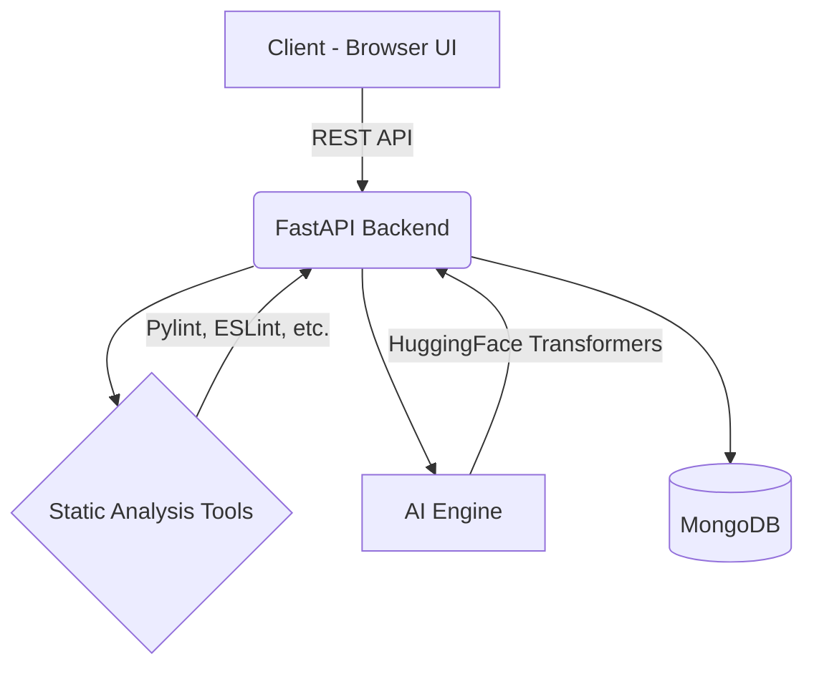

# 🚀 AI Code Reviewer

A scalable, full-stack AI-powered application that accepts source code, performs static analysis, and uses Machine Learning to detect bugs, suggest improvements, and refactor code.

## 🧱 Architecture Diagram



### Components
1. **Frontend (React + Tailwind + Monaco Editor):** The UI layer where users can paste or upload code to receive real-time, side-by-side split-view code feedback and metrics.
2. **Backend API (Python FastAPI):** Handles API requests, coordinates static analysis, communicates with the ML models, and saves results to MongoDB.
3. **AI Engine (Model layer):** Leverages `CodeT5` and `CodeBERT` depending on the review task, abstracting code refactoring and semantic analysis.
4. **Database (MongoDB):** Unstructured storage perfect for JSON data like nested code review outputs and historical submissions.

---

## ⚙️ Core Features
*   **Code Input:** Multi-language (Python, JS, Java, C++) support powered by Monaco Editor.
*   **Static Code Analysis:** Fast linting to catch syntax errors quickly without invoking ML.
*   **AI-Based Code Review:** Uses transformer networks (like CodeT5 from Hugging Face) to find logical flaws, anti-patterns, and semantic issues.
*   **Explanations & Refactoring:** Acts like a mentor, explaining "WHY" and generating the suggested refactored code.
*   **Scoring System:** Outputs a composite "Quality Score" (0-100) based on readability, performance, and bug frequencies.

---

## 🤖 AI / ML Implementation
*   **Primary Model:** [Salesforce/codet5-base](https://huggingface.co/Salesforce/codet5-base) (for code summarization and refactoring) and [microsoft/codebert-base](https://huggingface.co/microsoft/codebert-base) (for semantic search and defect detection). 
*   **Fallback:** For highly specific logical explanations, wrapping API calls to large LMs (like Gemini/OpenAI) is standard, but keeping it local with transformers is preferred for privacy.
*   **Preprocessing:** Tokenization using the AutoTokenizer, truncating long inputs, and parsing ASTs before feeding to the model.

---

## 🗄️ Database Schema Design (MongoDB)
*   **Submissions Collection:**
    ```json
    {
      "_id": "uuid",
      "user_id": "string",
      "code_content": "string",
      "language": "python",
      "timestamp": "datetime",
      "results": {
         "score": 85,
         "readability": 90,
         "performance": 80,
         "feedback": [
             {"line": 10, "type": "bug", "message": "List index out of range possibility", "suggestion": "Add length check"}
         ],
         "refactored_code": "..."
      }
    }
    ```

---

## 🚀 Deployment Plan
1.  **Frontend (Netlify):** Push changes to GitHub. Connect GitHub repo to Netlify. Set build command to `npm run build` and output dir to `dist`. Wait for automatic deployment.
2.  **Backend (Render / Railway):** Dockerize the FastAPI app or use Render's native Python environment. Ensure `UVICORN_PORT` is set.
3.  **Database:** Use MongoDB Atlas for a managed cloud DB cluster. Include the URI in the backend's `.env` file.
4.  **ML Model Deployment:** For lightweight transformer models, host them on the backend directly. For heavier models, use HuggingFace Inference Endpoints or AWS SageMaker.

---

## 📁 Project Structure
```
ai_code_reviewer/
│
├── frontend/             # React App
├── backend/              # FastAPI App
│   ├── api/              # API Endpoints
│   ├── core/             # Configs
│   ├── models/           # DB Schema Models
│   ├── services/         # AI & Static Analysis Logic
│   └── main.py           # Entrypoint
│
└── README.md             # This file
```
